<div align="center">
  

  # hey, I am bimonator
</div>

```json
{
  "user": "bimonator",
  "writes": "python", "html", "css", 
  "os": ["linux mint", "debian", "windows"],
  "also": ["powershell", "javascript", "git"],
  "tinkering": ["hackthebox", "raspberry pi", "ollama"],
  "others": ["claude", "cursor"],
}
```
<p align="center">
  
  
  
  
  
  
    
    
  ```python
longest_streak:
```

<p align="center">
  <a href="https://github.com/bimonator">
    
  </a>
</p>


<p align="center">
 tools

<p align="center">
  <a href="https://skillicons.dev">
    
  </a>
</p>

<p align="center">
Linux · Windows · Python · JavaScript · Git · Networking
